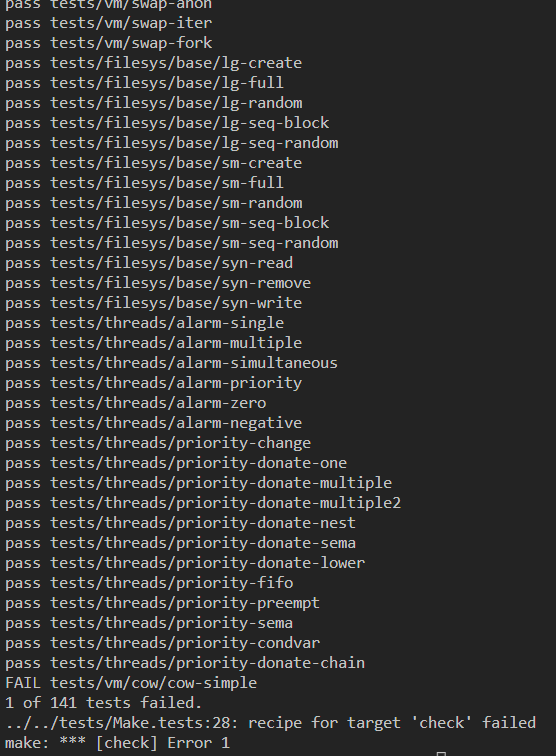

# 2023.12.26

### 1182 부분수열의 합

- 문제
  N개의 정수로 이루어진 수열이 있을 때, 크기가 양수인 부분수열 중에서 그 수열의 원소를 다 더한 값이 S가 되는 경우의 수를 구하는 프로그램을 작성하시오.

- 입력
  첫째 줄에 정수의 개수를 나타내는 N과 정수 S가 주어진다. (1 ≤ N ≤ 20, |S| ≤ 1,000,000) 둘째 줄에 N개의 정수가 빈 칸을 사이에 두고 주어진다. 주어지는 정수의 절댓값은 100,000을 넘지 않는다.

- 예제를 통한 분석
  예제 입력 예제 출력
  5 0 1
  -7 -3 -2 5 8

---

5개의 인자 / 0이라는 목표  
주어진 숫자 -7, -3, -2, 5, 8 /// 0이라는 목표는 1개 가능 {(-3)+(-2)+(5)}

출력은 count로 해야한다.

- think 1
  밑의 줄을 2중 for문으로 돌면서 각 인자의 합이 '0'이라는 목표에 도달하면 count +1되고, 그것을 출력하는 방식으로 진행?
  -> 2개의 인자만 돌게 되는데, 우리가 위에서 봤듯이 3개의 인자를 받을 때도 있다. 아니, 그냥 여러개의 인자를 받아서 목표를 도달할 수 있도록 진행해야한다.

- think 2

sum을 이용해서 진행하자. sum == S가 목표이니 , if sum(seuqence) == S 라면 count += 1 하는 방식으로 진행하는게 옳지않나?
하지만 sum에 대한 괄호 값은 어떻게 구하지?

- 답지 참고

재귀 함수와 백트래킹을 이용한다.

```python
N,S = map(int,input().split())
num = list(map(int,input().split()))
cnt = 0
ans = []

def solve(start):
    global cnt
    if sum(ans) == S and len(ans) > 0:  #여기에서 sum(ans) == S 까진 생각 가능했겠으나 len(ans) > 0:이 생각 안났을듯
    cnt += 1

    for i in range(start, N):           #재귀 및 백트래킹에서 항상 나오는 부분
    ans.append(num[i])
    solve(i+1)
    ans.pop()

solve(S)
print(cnt)
```

- 재귀 & 백트래킹 부분 짚고 넘어가기
  for i in range (start,N) -> solve의 인자 start(0)부터 N까지 진행
  ans.append(num[i])는 빈 리스트에 input받은 list를 더하는 작업이다.
  solve 함수를 재귀호출하며 +1에 대한 값을 진행한다.
  아닐 경우, pop 진행하면서 백트래킹을 진행한다. (즉, if 구문에 대한것이 실패하면 ans.pop으로 돌아간다.)

if 구문이 성공하면 count+1 , 아니면 backtracking을 통해 맨 앞 부분을 pop하면서 계속 순회하는 구조

- 깨달은 점

1. Input 받을 때 2가지이면 map이고, int,input().split()
2. 백트래킹에 대한 기본 구조를 암기하고 활용해보자 (def , for, pop)

### Pintos trouble Shooting

#### page-merge-mm

`pintos -v -k -T 60 -m 20   --fs-disk=10 -p tests/vm/page-merge-mm:page-merge-mm -p tests/vm/child-qsort-mm:child-qsort-mm --swap-disk=10 -- -q   -f run page-merge-mm`

```c
Putting 'child-qsort-mm' into the file system...
Executing 'page-merge-mm':
(page-merge-mm) begin
(page-merge-mm) init
(page-merge-mm) sort chunk 0
(page-merge-mm) sort chunk 1
child-qsort-mm: exit(80)
(page-merge-mm) sort chunk 2
child-qsort-mm: exit(80)
(page-merge-mm) sort chunk 3
child-qsort-mm: exit(80)
(page-merge-mm) sort chunk 4
child-qsort-mm: exit(80)
(page-merge-mm) sort chunk 5
page-merge-mm: exit(-1)
Execution of 'page-merge-mm' complete.
Timer: 223 ticks
Thread: 30 idle ticks, 43 kernel ticks, 150 user ticks
hd0:0: 0 reads, 0 writes
hd0:1: 1755 reads, 4402 writes
hd1:0: 224 reads, 0 writes
hd1:1: 0 reads, 0 writes
Console: 1331 characters output
Keyboard: 0 keys pressed
Exception: 1 page faults
```

#### page-merge TC의 공통 문제

- child-sort를 처리하는 과정에서 exit가 일찍 진행된다.

- 자세히 살펴보니, fork도 제대로 안되고 mapping도 제대로 안된다.

* 어디를 고칠 것인가!!?

1. lock acquire / release 호출 부분을 고치자

- 현재 상황에서는 `load` 함수 내에서 lock acquire 및 release를 진행 중이였는데, 그것을 `process exec` 함수에서 호출하는 것으로 변경
- qsrot에서 가장 많이 호출하는 함수인 `create`에 대해서 lock acquire 및 release를 진행해 안정성 향상

#### 중간 점검

- 아무것도 달라진게 없다!!

그렇다면 lock_acquire 자체가 문제가 아닐까??

2. lock acquire 함수 자체 수정

- 현재 lock acquire은 VM / USERPROG 구분 없이 동작하는 중

- 해당 lock acquire에서 섹터를 나눠서 진행하면 좋지 않을까??
  - #ifndef USERPROG 로 sector를 나눠서 진행하니까 page-merge 관련 TC는 정상적으로 작동!
    그러나 기존 통과 TC였던 priority-donate가 터지기 시작

#### 깊은 고뇌의 시간

3. 선택지는 2개
   기존 터지던 TC를 볼 것인가 (page-merge / 2~3개 난이도 上)

새로 터지게 된 TC를 볼 것인가 (priority-donate / 8개 )

다시 생각해보니 #ifndef USERPROG 자체가 의미가 없는 선언! 묶어둔 기능을 안쓰는 것과 마찬가지
하지만, 우리는 기능을 묶어둠으로서 page-merge가 통과된 것을 확인

4. 그렇다면 lock acquire 함수 자체를 전체 고쳐보자

기존 lock acquire에서는 list_insert_orderd로 진행했던 반면, list_push_back으로 진행

### 결과



#### list_insert -> push_back이 정답??

이것은 아닌 듯 하다.

결국 돌아가서 Pintos의 TC는 SORT 한 뒤에 Mapping이 정확히 이뤄지는지를 판단하는 TC인데
그 과정에서 우리는 lock을 적절히 활용하여 Mapping이 안전하게 이뤄지도록 해야한다.

lock acquire 자체가 잘 짜여진 상황이라면 insert 방식이든, push 방식이든 상관없이 진행됐을 것이며
중요한 점은 '적절한 곳에 lock acquire와 release를 진행' 하는 것이 핵심이다.
